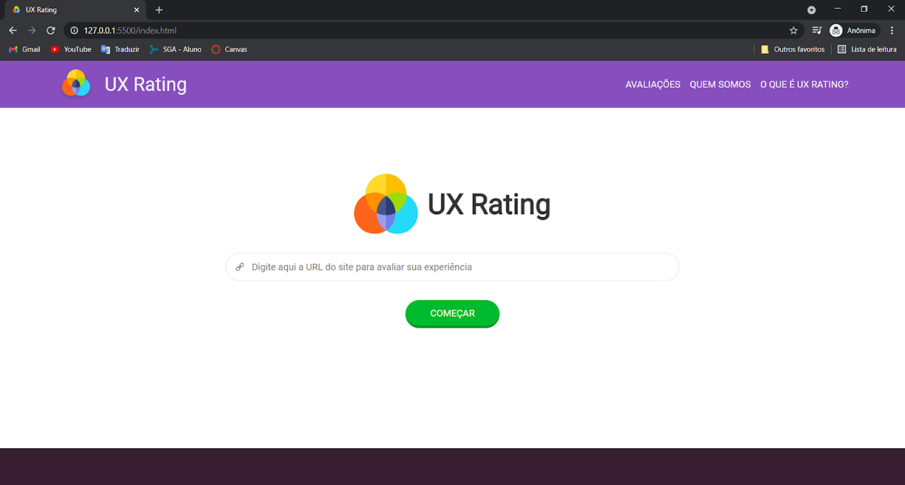
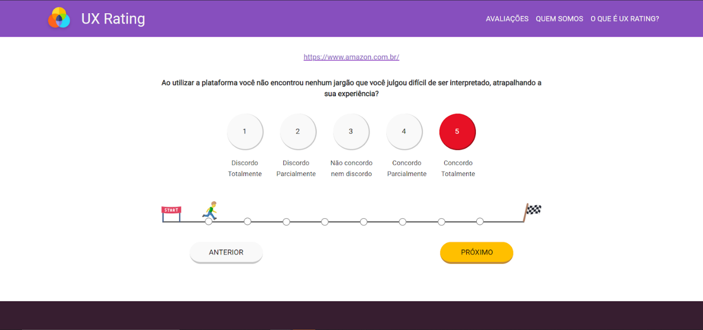
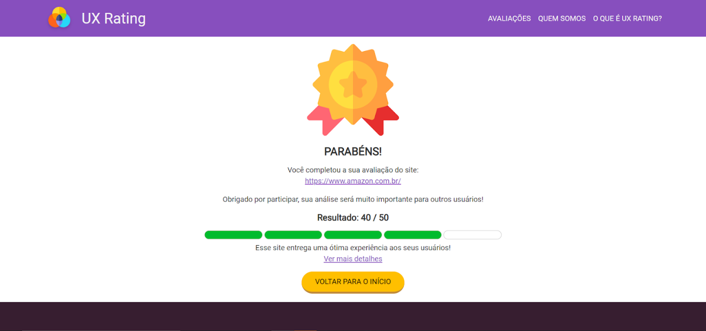
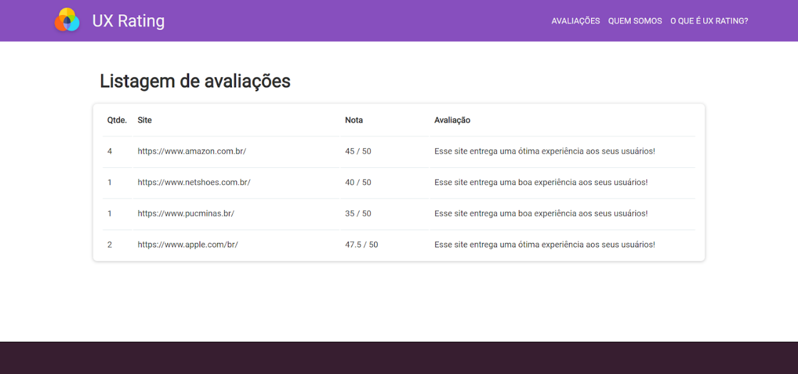
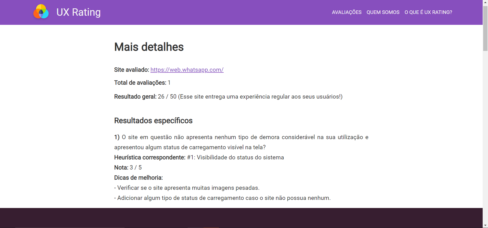

<h1 align="center">
    
</h1>

Esse projeto foi desenvolvido como Tabalho de Conclusão de Curso para o curso de Sistemas de Informação da PUC Minas Betim, apresentado à banca e aprovado ao final do primeiro semestre de 2021.

# Tabela de conteúdos 🔖

* [Sobre](#Sobre-📋)
    * [Funcionalidades](#Funcionalidades-🚀)
* [Deploy da Aplicação](#Deploy-da-Aplicação-💨)
* [Como usar](#como-usar-🔎)
    * [Pré-requisitos](#Pré-requisitos-🧰)
    * [Armazenamento](#Armazenamento-💾)
* [Tecnologias](#Tecnologias-💻)

# Sobre 📋

<h4 align="center">
📝 Projeto UX Rating ✅ Finalizado em 09/06/2021 📝
</h4>

O UX Rating é uma plataforma que tem como um de seus objetivos ajudar sites a melhorarem a experiência de seus usuários ao utilizá-los. E o principal da plataforma é avaliar os sentimentos de seus usuários e possíveis pontos de melhorias nos sites avaliados, com o intuito de deixar cada vez mais usuários satisfeitos.

## Funcionalidades 🚀

- [x] Avaliar um site
- [x] Armazenar avaliações
- [x] Calcular média das avaliações
- [x] Apresentar os resultados
- [x] Explicar os resultados
- [x] Oferecer dicas de melhoria

<h3 align="center">
    
    
Tela Inicial do UX Rating

    
    
Tela de Perguntas

    
    
Tela de Resultado

    
    
Listagem de Avaliações

    
    
Detalhes de uma avaliação

</h3>

# Deploy da Aplicação 💨

> Link do deploy da aplicação, realizado pelo GitHub Pages: https://rafael-alms.github.io/UX-Rating/

# Como usar 🔎

* Insira o site a ser avaliado utilizando a URL completa. Exemplo: https://github.com/
* Responda as perguntas dando uma nota de 1 a 5, conforme instruções.
* Ao finalizar o questionário é possível visualizar tanto o resultado da sua avaliação, como abrir a tela "Mais detalhes" para ver os resultados das avalições em geral.
* Clicando no link "Avaliações" no canto superior direito da tela, todas as avaliações realizadas são exibidas, clicando em uma delas, a tela "Mais detalhes" irá abrir com as informações do site selecionado.
* Os links "Quem somos" e "O que é UX Rating?" levam a componentes do site que apresentam informações sobre os autores e sobre os principais conceitos deste trabalho, respectivamente.
* Clicar na logo (a qualquer momento), no canto superior esquerdo da página, irá recarregar o site.

## Pré-requisitos 🧰

* Para utilizar o UX Rating em sua máquina você precisará apenas de um navegador, de preferência o Google Chrome.
* Para trabalhar com o código do UX Rating você pode usar o [VS Code](https://code.visualstudio.com/) ou outro programa de sua preferência.

## Armazenamento 💾

* O UX Rating utiliza [Local Storage](https://www.w3schools.com/jsref/prop_win_localstorage.asp) para armazenar as avaliações. Sendo assim, elas ficam armazenadas no navegador utilizado.
* Para excluir as avaliações, é necessário apenas limpar o Local Storage, apagando os dados de navegação ou [apagar manualmente](https://developer.chrome.com/docs/devtools/storage/localstorage/?utm_source=devtools) por meio das ferramentas de desenvolvedor do navegador.

# Tecnologias 💻
As seguintes ferramentas foram usadas na construção do projeto:
- HTML5
- CSS3
- JavaScript

---

Made with 💜 by [Rafael de Almeida Silva](http://linkedin.com/in/rafael-de-almeida-96492073) & [Marco Túlio Pereira Lima](http://linkedin.com/in/marco-túlio-pereira-lima-1196a11ab) 👋
